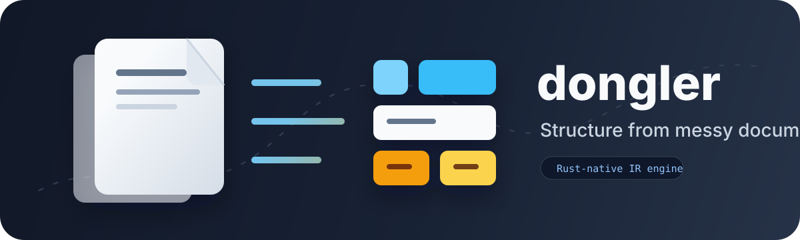
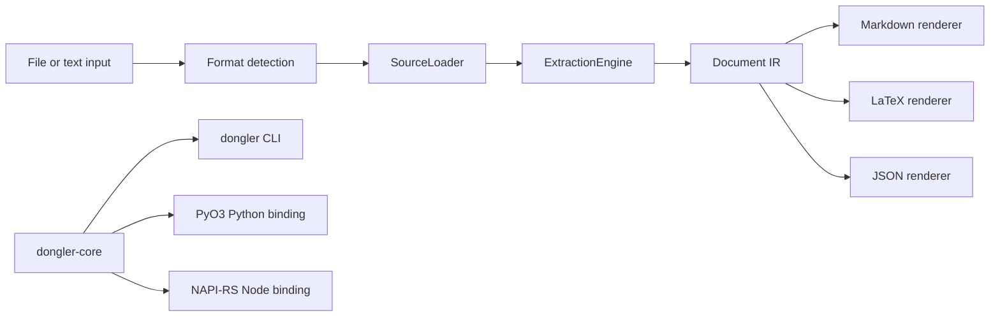

# Dongler

Dongler is a Rust-native document extraction engine with Python and JavaScript
bindings. Its job is to turn messy documents into structured data, then render
that structure into formats developers can use.

Created by Daniel Fat.

## Project Status

Dongler `0.1.0` is an initial working release, not a finished PDF extractor.
The current engine extracts plain text into a document IR and renders that IR as
Markdown, LaTeX, or JSON. The package structure is designed around the next
major target: PDF extraction with reliable text, tables, layout, and metadata.

The product focus is deliberately narrow:

- Do PDF extraction well.
- Produce clean Markdown and LaTeX.
- Keep JSON and the internal IR stable enough for developers to build on.
- Add Word, Excel, HTML, images, and email only after the PDF path is strong.

## What Works Today

- `.txt` extraction through the Rust core.
- Paragraph splitting into `TextBlock` values.
- Markdown rendering.
- LaTeX rendering with escaping for LaTeX-sensitive characters.
- JSON rendering of the internal document IR.
- CLI, Python, and TypeScript APIs that call the Rust implementation.
- Format detection for text, PDF, Excel, Word, HTML, images, and email.

PDF, table, and layout extraction are planned. The CLI detects PDFs today, but
extraction returns a clear planned-but-not-implemented error until the PDF engine
lands.

## Install

```bash
cargo install dongler
pip install dongler
npm install dongler
```

For Rust library usage, depend on `dongler-core`. The public `dongler` crate is
the CLI package so `cargo install dongler` works as expected.

## CLI

```bash
dongler --version
dongler inspect notes.txt
dongler extract notes.txt --format markdown
dongler extract notes.txt --format latex
dongler extract notes.txt --format json
```

`inspect` reports the detected format and whether extraction is currently
supported:

```text
path: report.pdf
format: pdf
extraction_status: planned
```

## API Examples

Rust:

```rust
use dongler_core::{parse_text, to_latex, to_markdown};

fn main() -> dongler_core::Result<()> {
    let document = parse_text("Hello from Dongler\n\nSecond paragraph")?;
    println!("blocks: {}", document.metadata.block_count);
    println!("{}", to_markdown("Hello from Dongler")?);
    println!("{}", to_latex("Revenue is 100%")?);
    Ok(())
}
```

Python:

```python
import dongler

doc = dongler.parse_text("Hello from Dongler\n\nSecond paragraph")
print(doc["metadata"]["block_count"])
print(dongler.to_markdown("Hello from Dongler"))
print(dongler.to_latex("Revenue is 100%"))
```

TypeScript:

```ts
import { parseText, toLatex, toMarkdown } from "dongler";

const doc = parseText("Hello from Dongler\n\nSecond paragraph");
console.log(doc.metadata.block_count);
console.log(toMarkdown("Hello from Dongler"));
console.log(toLatex("Revenue is 100%"));
```

## Package Map

```text
crates/dongler-core      Rust source of truth: IR, engines, loaders, renderers
crates/dongler-cli       `dongler` command line interface
crates/dongler-python    PyO3 extension module used by the Python package
crates/dongler-node      NAPI-RS native addon used by the npm package
python/dongler           Thin Python API over the Rust extension
node/src                 TypeScript API and public types over the native addon
docs                     Architecture, roadmap, and private corpus notes
```

Rust owns extraction logic. Python and TypeScript only adapt Rust results into
native package APIs.

## Architecture



The important boundary is the `Document` IR. Engines convert source material
into the IR. Renderers convert the IR into output formats. Bindings expose the
same Rust behavior to each ecosystem.

Read more in [docs/architecture.md](docs/architecture.md).

## Document IR

The current IR is intentionally small:

- `Document`: metadata plus pages.
- `Page`: page number plus ordered blocks.
- `Block`: tagged text or table content.
- `TextBlock`: paragraph text with a simple kind.
- `TableBlock`: headers, rows, and optional caption.
- `Metadata`: format, engine, source, title, character count, word count, and
  block count.

The renderers already know how to render `TableBlock` values to Markdown and
LaTeX. The current text engine does not extract tables yet; that work belongs in
the PDF/table extraction engines.

## PDF Roadmap

The first serious document target is PDF. The planned sequence is:

1. Extract page text with stable reading order.
2. Preserve page-level metadata and document metadata.
3. Detect simple ruled and unruled tables.
4. Add layout coordinates to IR blocks.
5. Render PDF-derived content cleanly to Markdown and LaTeX.
6. Expand to Word, Excel, HTML, images, and email after the PDF path is useful.

See [docs/pdf-roadmap.md](docs/pdf-roadmap.md) for the working roadmap.

## Development

Use `uv` for Python development. Do not add `requirements.txt`.

```bash
make test
make build
```

Focused commands:

```bash
make test-rust
make test-python
make test-js
```

Private corpus tests are supported in CI through a private archive URL and
checksum. The corpus is not committed to the repository. See
[docs/private-corpus.md](docs/private-corpus.md).

## Publishing

The `Build and Publish` GitHub Actions workflow publishes from `main` after
public tests and private corpus smoke tests pass.

Required GitHub secrets:

- `CARGO_REGISTRY_TOKEN`: crates.io API token with publish rights for
  `dongler-core` and `dongler`.
- `NPM_TOKEN`: npm automation token with publish rights for `dongler`.
- `DONGLER_CORPUS_URL`: private HTTPS URL for a `.tar.gz` corpus archive.
- `DONGLER_CORPUS_SHA256`: SHA-256 checksum of that private corpus archive.
- `DONGLER_CORPUS_AUTH_HEADER`: optional HTTP auth header for the corpus URL.

PyPI is configured for trusted publishing through the workflow environment
`pypi`, so no PyPI token is required when that publisher is configured.

Dry-run commands:

```bash
cargo publish --dry-run -p dongler-core
cargo publish --dry-run -p dongler
uv build
uv run maturin build
cd node && npm pack --dry-run
cd node && npm publish --dry-run
```

Publish `dongler-core` before the CLI package `dongler`; the CLI depends on the
core crate by version.

## License

Dongler is licensed under the MIT License. See `LICENSE` and `NOTICE`.
